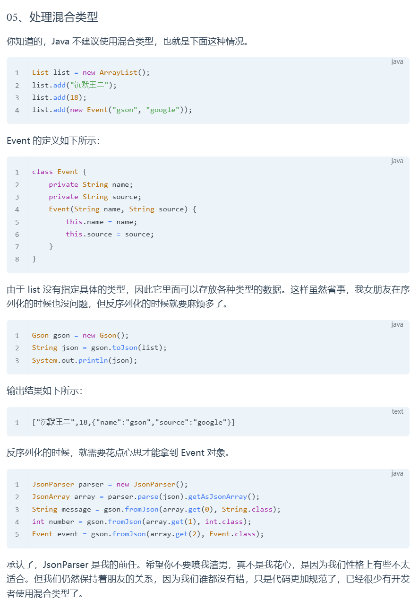

## Gson

## 0.环境配置

```groovy
dependencies {
  implementation 'com.google.code.gson:gson:2.8.6'
}
```


## 1.概念

用于对类的序列化与反序列化（字符化和对象化）

## 2.基本语法和使用

### 1.语法介绍

```java
//1.创建对象
Gson gson=new gson();
gson.toJson();//序列化，参数可以是想要序列化的对象，如gson.toJson(values)，values是数组名
gson.fromJson();//反序列化，参数是json数据并指定要赋予的类型，如String[] anotherStr = gson.fromJson("[\"沉默\",\"王二\"]", String[].class);
```

### 2.使用方法

#### 1.当序列化和反序列化对象是类时

```java
public class Test01 {
    public static void main(String[] args) {
        Gson gson = new Gson();
        // 序列化
        Person person = new Person("willwaywang6", 18);
        String personJson = gson.toJson(person);
        System.out.println(personJson);

        // 反序列化
        String json = "{\"name\":\"willwaywang6\",\"age\":18}";
        Person p = gson.fromJson(json, Person.class);
        System.out.println(p);
    }
}
```

结果是序列化和反序列化时数据都可以和原来的属性对应

#### 2.当序列化和反序列化对象是泛型类时

**错误示范**

```java
Gson gson = new Gson();
// 序列化
Person person = new Person("willwaywang6", 18);
Response<Person> response = new Response<>();
response.code = 0;
response.message = "success";
response.data = person;
String responseJson = gson.toJson(response);//这里转型出问题，不是response
System.out.println(responseJson);
```

这样得到的序列化和反序列化数据不一致，其中**序列化前是Person类，序列化后时linkMapTree**，无法对应。

**正确实例**

```java
Gson gson = new Gson();
// 反序列化
String json = "{\"code\":0,\"message\":\"success\",\"data\":{\"name\":\"willwaywang6\",\"age\":18}}";
Type responseType = new TypeToken<Response<Person>>() {}.getType();//先获取泛型存的类
Response<Person> r = gson.fromJson(json, responseType);//指定转成的类型是原泛型村的类型
System.out.println(r);
System.out.println(r.data);
```

## 3.注释

用于指定是否序列化和反序列化，以及对等到的序列化进行处理后正确赋值

### 1.`@SerializedName` 注解

#### 1.基本用法

序列化时：

`Respondse`类

```java
class Response {
    
    public int code;
    public String message;
    public String data;

    @Override
    public String toString() {
        return "Response{" +
                "code=" + code +
                ", message='" + message + '\'' +
                ", data=" + data +
                '}';
    }
}
```

需要的`Json`数据

```
{
	"code": 0,
	"msg": "ok",
	"content": "some data"
}
```

如果如上不做处理直接像基本用法一样序列化，得到结果

```
{"code":0,"message":"ok","data":"some data"}
```

发现需要的content变成了data，出错。

改正只需要改`Respondse`类，为其中加入序列化注释

```Java
class Response {
    public int code;
    @SerializedName("msg")
    public String message;
    @SerializedName("content")
    public String data;
}
```

得到结果符合要求

```
{"code":0,"msg":"ok","content":"some data"}
```

反序列化时：

如果获得的Json数据和序列化时需要的Json一致并且Response是错误示范这样写，那么在反序列化时会得到空的data，原因是Content不匹配。将其改为正确的示范Response时就可以了

#### 2.alternative

```java
class Response {
    public int code;
    @SerializedName("msg")
    public String message;
    @SerializedName(value = "content", alternate = {"result", "result_data"})
    public String data;
}

```

当Response这样写时表示如Json数据中出现了这三个字段都会赋给data，如果Json中同时出现这三个字段，则取最后一个出现的赋值。

### 2.`@Expose` 注解

#### 1.基本用法

Person代码

```java
public class Person {
    @Expose
    String firstName;
    @Expose(deserialize = false)
    String lastName;
    @Expose(serialize = false)
    int age;
    @Expose(serialize = false, deserialize = false)
    String password;
    String phoneNumber;
}
```

在这个注释下导致


主代码：

```java
Gson gson = new GsonBuilder().excludeFieldsWithoutExposeAnnotation().create();//注意new的方式不同，按原方法new这个注释不起作用
//后面正常序列化反序列化
```

得到的结果为：

```
{"firstName":"zhichao","lastName":"wang"}//序列化
Person{firstName='zhichao', lastName='null', age=18, password='null', phoneNumber='null'}//反序列化
```

#### `@Expose` 与 `transient` 关键字的区别：

声明了 `@Expose` 注解的字段，可以单独地控制是否进行序列化和是否进行反序列化；
而使用 `transient` 关键字修饰的字段，既不可以序列化，也不可以反序列化

## 4.配置

### 1.使用 `serializeNulls()` 配置，强制序列化 `null` 值

这个是为了将类中的所有都序列化。基本用法情况下无值则不参与序列化。现在无值参与序列化，参与为null

创建Gson对象：

```java
Gson gson = new GsonBuilder().serializeNulls().create();
//后面与前类似
```

### 2.使用 `setPrettyPrinting()` 配置，格式化 json 字符串打印

这个是为了将序列化结果展示的更好看

创建对象

```java
Gson gson = new GsonBuilder().setPrettyPrinting().create();
//其他与前类似
```

基本用法下结果展示

```
{"userid":"204895272048","username":"奥特曼","password":"1234567890","age":1000,"height":300,"salary":30000.0,"address":"outer space, unknown"}

```

用后展示


### 3.使用`disableHtmlEscaping()` 配置，去除 html 字符转义

转化字符令字符易懂

如果有一句话"Mr Bush's House"，序列化后为{"title":"Mr Bush\u0027s House","message":"a \u003e b"}，看不懂

那么使用这个创建对象

```java
Gson gson = new GsonBuilder().disableHtmlEscaping().create();
```

序列化结果：Mr Bush's House，易懂

### 4.使用 `setExclusionStrategies(ExclusionStrategy... strategies)` 配置，添加灵活的排除策略

```java
Gson gson = new GsonBuilder().setExclusionStrategies(new ExclusionStrategy() {
    @Override
    public boolean shouldSkipField(FieldAttributes f) {
        
        return f.getName().startsWith("_");//表示返回的Json数据会将原来变量名中的_去掉
    }
    @Override
    public boolean shouldSkipClass(Class<?> clazz) {
        return clazz == Date.class || clazz == boolean.class;//表示返回Json数据时出去Data和bollean类
    }
}).create();
```

## 补充


