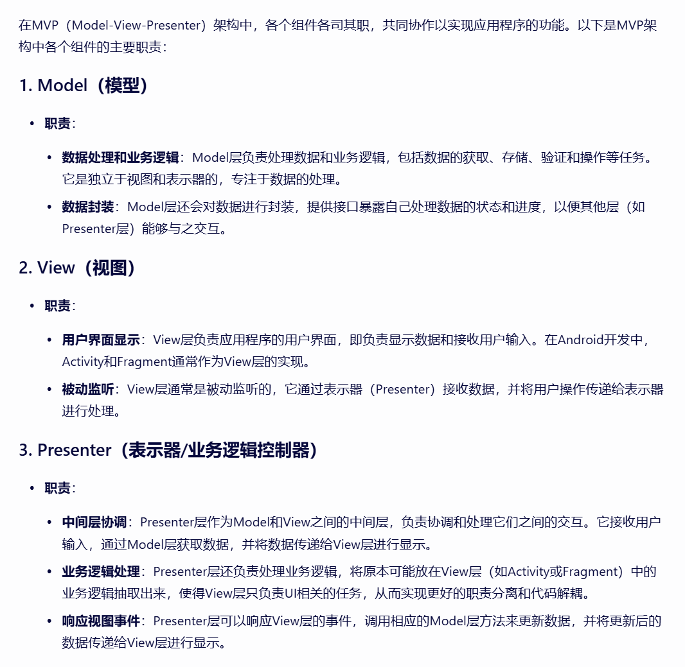
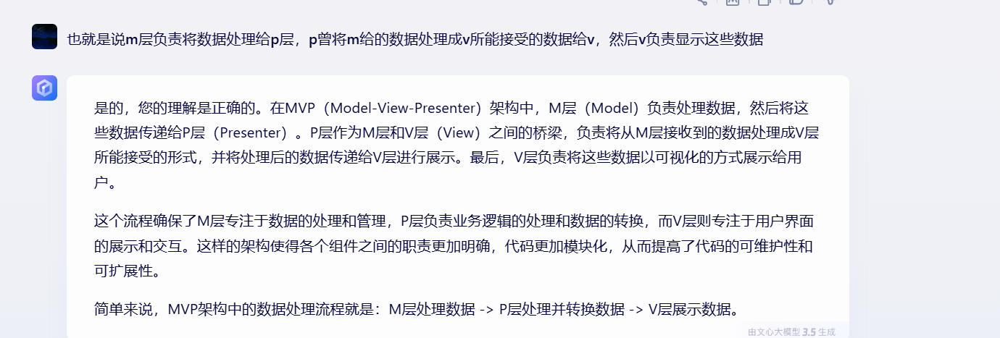

# MVC、MVP、MVVM架构

## 1.MVC

先上图

如图，主要思想就是view传数据给controller，controller处理出一些数据存在model，然后model将数据更新给view

## 2.MVP

如图，主要思想就是以Presenter为桥梁，获取view中得到的数据，传给model进行数据处理，model处理完将数据返给presenter，presenter再将数据推送到指定view位置

## 3.MVVM

如图，view有数据时自动传到viewholder，viewholder进行数据传递给model，model处理完后将数据返给viewholder，viewholder接收到数据后自动将view中数据更新。