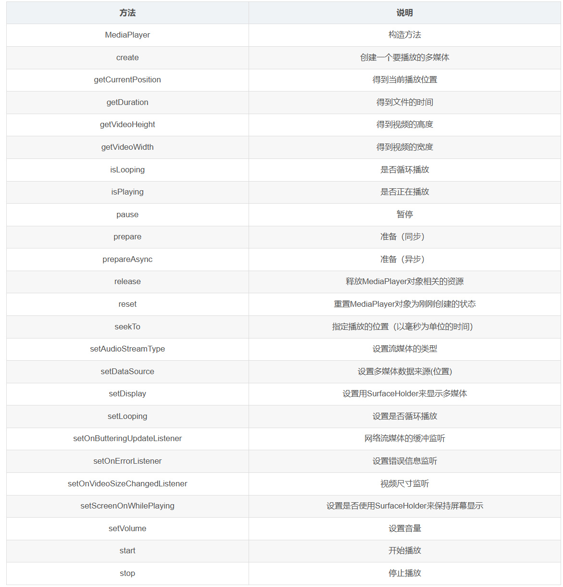

# MediaPlayer


## 1，基础使用

```java
Uri myUri = ....; // initialize Uri here

//创建对象
MediaPlayer mediaPlayer = new MediaPlayer();//空闲状态

//用来进行设定media的播放样式
mediaPlayer.setAudioAttributes(
    new AudioAttributes.Builder()
        .setContentType(AudioAttributes.CONTENT_TYPE_MUSIC)//设置播放内容是音乐
        .setUsage(AudioAttributes.USAGE_MEDIA)//运用media播放
        .build()
);
//对mediaplayer的状态设定
mediaPlayer.setDataSource(getApplicationContext(), myUri);//初始化状态，网络url只传字符串
mediaPlayer.prepare();//就绪，会阻塞。建议使用 prepareAsync() 方法进行准备。
mediaPlayer.start();//开始

//如果您使用的是 MediaPlayer，并且您的 activity 收到对 onStop() 的调用，则必须释放 MediaPlayer。否则一直存在浪费资源
```

## 2，在 Service 中使用 MediaPlayer

如果您希望即使应用未在屏幕上播放，也想在后台继续播放媒体内容（也就是说，您希望在用户与其他应用交互时继续播放），您必须启动一个 Service 并从该 Service 控制 `MediaPlayer` 实例。您需要将 MediaPlayer 嵌入到 `MediaBrowserServiceCompat` 服务中，并让其与其他 activity 中的 `MediaBrowserCompat` 互动。

### 异步运行

首先，与 `Activity` 一样，`Service` 中的所有工作默认在单个线程中完成。事实上，如果您从同一应用运行 activity 和服务，它们将默认使用相同的线程（“主线程”）。因此，服务需要快速处理传入的 intent，并且在响应它们时从不执行冗长的计算。如果预计会执行繁重的工作或阻塞调用，您必须异步执行这些任务：要么从您自己实现的另一个线程执行，要么使用框架的诸多工具进行异步处理。

例如，从主线程中使用 `MediaPlayer` 时，您应该调用 `prepareAsync()` 而不是 `prepare()`，并实现 `MediaPlayer.OnPreparedListener`，以便在准备完成并可以开始播放时收到通知。例如

```java
public class MyService extends Service implements MediaPlayer.OnPreparedListener {
    private static final String ACTION_PLAY = "com.example.action.PLAY";
    MediaPlayer mediaPlayer = null;

    public int onStartCommand(Intent intent, int flags, int startId) {
        ...
        if (intent.getAction().equals(ACTION_PLAY)) {
            mediaPlayer = ... // initialize it here
            mediaPlayer.setOnPreparedListener(this);
            mediaPlayer.prepareAsync(); // prepare async to not block main thread
        }
    }

    /** Called when MediaPlayer is ready */
    public void onPrepared(MediaPlayer player) {
        player.start();
    }
}
```

### 处理异步错误

在同步操作中，系统通常通过异常或错误代码来指示错误，但每当使用异步资源时，都应确保应用以适当的方式收到错误通知。对于 `MediaPlayer`，您可以通过实现 `MediaPlayer.OnErrorListener` 并在 `MediaPlayer` 实例中进行设置来实现此目的：

```java
public class MyService extends Service implements MediaPlayer.OnErrorListener {
    MediaPlayer mediaPlayer;

    public void initMediaPlayer() {
        // ...initialize the MediaPlayer here...
        mediaPlayer.setOnErrorListener(this);
    }

    @Override
    public boolean onError(MediaPlayer mp, int what, int extra) {
        // ... react appropriately ...
        // The MediaPlayer has moved to the Error state, must be reset!
    }
}
```

请务必注意，出现错误时，`MediaPlayer` 会变为 *Error* 状态您必须对其进行重置，然后才能再次使用它。

### 使用唤醒锁定

在设计在后台播放媒体内容的应用时，设备可能会在服务运行时进入休眠状态。由于 Android 系统会在设备处于休眠状态时尝试节省电池电量，因此系统会尝试关闭手机的所有不必要的功能，包括 CPU 和 Wi-Fi 硬件。但是，如果您的服务正在播放或流式传输音乐，您需要防止系统干扰播放。

为了确保 CPU 在 `MediaPlayer` 播放时继续运行，请在初始化 `MediaPlayer` 时调用 `setWakeMode()` 方法。完成该操作后，`MediaPlayer` 会在播放时保持指定的锁，并在暂停或停止时释放该锁：

```java
mediaPlayer = new MediaPlayer();
// ... other initialization here ...
mediaPlayer.setWakeMode(getApplicationContext(), PowerManager.PARTIAL_WAKE_LOCK);
```

不过，此示例中获取的唤醒锁定只能保证 CPU 保持唤醒状态。如果您通过网络在线播放媒体内容，并且使用的是 Wi-Fi，则可能也希望保留 `WifiLock`，您必须手动获取并释放它。因此，当您开始使用远程网址准备 `MediaPlayer` 时，应创建并获取 Wi-Fi 锁。例如：

```java
WifiLock wifiLock = ((WifiManager) getSystemService(Context.WIFI_SERVICE))
    .createWifiLock(WifiManager.WIFI_MODE_FULL, "mylock");

wifiLock.acquire();
```

**当您暂停或停止媒体，或者当您不再需要网络时，应释放锁定：**

```java
wifiLock.release();
```

### 进行清理

如前所述，`MediaPlayer` 对象会消耗大量系统资源，因此您应该仅保留其需要的时间，并在使用完对象后调用 `release()`。请务必明确调用此清理方法，而不是依赖于系统垃圾回收，因为垃圾回收器可能需要一些时间才能回收 `MediaPlayer`，因为它只对内存需求敏感，不对其他媒体相关资源不足。因此，当您使用某项服务时，应始终替换 `onDestroy()` 方法，以确保释放 `MediaPlayer`：

```java
public class MyService extends Service {
   MediaPlayer mediaPlayer;
   // ...

   @Override
   public void onDestroy() {
       super.onDestroy();
       if (mediaPlayer != null) mediaPlayer.release();
   }
}
```

除了在关闭时释放 `MediaPlayer` 之外，您还应始终寻找其他释放机会。例如，如果您预计长时间（例如在失去音频焦点后）无法播放媒体，请务必释放现有的 `MediaPlayer`，并在稍后重新创建。另一方面，如果您仅希望停止播放一小段时间，则应该使用 `MediaPlayer`，以避免再次创建和准备它的开销。

