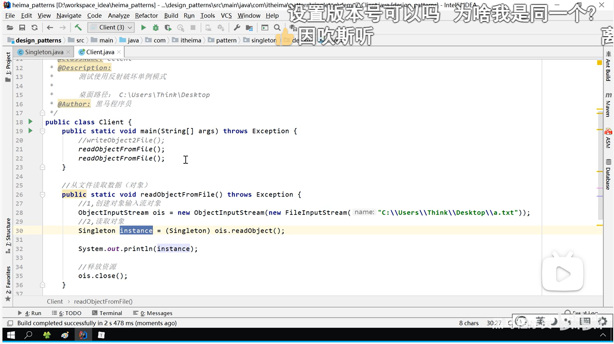
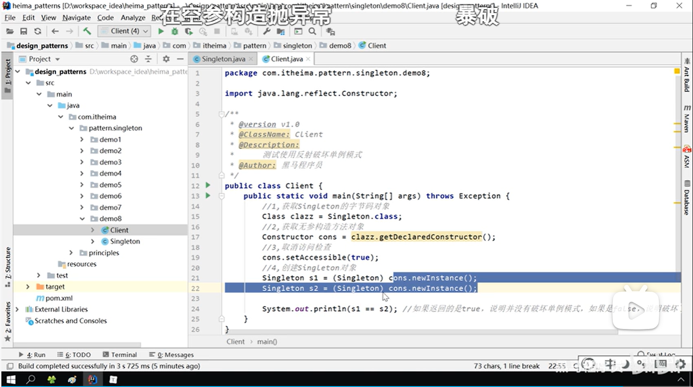

# 单例设计模式

掌握思想

## 1.介绍

这种模式涉及到一个单一的类负责创建自己的对象，同时确保只有1单个对象被创建。这个类提供了一种访问其唯一的对象方式，可以直接访问而不需要实例化。例如访问类、单例类、工具类。

## 2.单例模式的实现

### 1.饿汉式

类加载就会导致该单实例对象被创建。

```java
public void singleton(){
    //1.私有化构造方式
    private singleton(){}
    //2.进行静态创建对象
    private static singleton instance=new singleton();
    //3.返回对象
    public static singleton getinstance(){
        return instance
    }
}
```

###  2.懒汉式

类的加载不会导致该单实例对象被创建，而是首次使用该对象时才会创建。

方法一：（麻烦）

```java
public class Singleton(){
    //1.私有构造方法
    private Singleton(){}
    //2.声明变量
    private static volatile Singleton instance;
    //3.书写getIstance
    public static Singleton getInstance(){
        if (instance== null){
            synchronized (Singleton.class){
                if (instance == null)
                    instance = new Singleton();
            }
        }
        return instance;
    }
}
```

volatile的原因是使其在赋值操作时步骤不被优化，这样就可以避免野指针

具体原因：http://t.csdnimg.cn/D7GaB

方法二：（推荐）

```java
public class Singleton(){
    //1.私有构造方法
    private Singleton(){}
    //2.静态内部类初始化
    private static final  class SingletonHolder{
        private static final Singleton INSTANCE=new Singleton();
    }
    //3.对外提供静态类方法获取该对象
    public static Singleton getInstance(){
        return SingletonHolder.INSTANCE;
    }
}
```

原理：静态内部类在加载进JVM时不被加载，尽在内部类被使用时才会被加载并初始化静态属性。保证制备实例化一次并严格保证实例化顺序。

### 3.枚举（恶汉式）

线程安全并只加载一次，且唯一一种不会被破坏的单例实现模式。

用一个枚举（平行于类的一个文件）

```java
public enum Singleton{
    	INSTANCE;
}
```

创建对象方式

```java
Singletoin instance=Singleton.INSTANCE;
```

## 3.破坏单例模式及解决方法

除枚举外都可以破坏单例

### 1.反序列化

通过反序列化时底层会自动创建一个对象（用反射创建的）来使单例破环。比较经典的就是文件的输入输出。



此时两次打印出来的是两个不同的实例。

解决方法：在singleton中添加readResolve方法，这样在反序列化时就可以直接跳到readResolve方法而不直接创建对象（反序列化底层逻辑就是看类里有没有readResolve方法，有则调用，无则自己创建一个新对象进行存储。）

### 2.反射

反射原理就是暴力获取原单例模式中的构造方法强行破坏单例



这里对注释稍微加以注释：

//2.获得无参构造方法对象：就是运用右式可以获得该类的无参构造方法。

//3.取消访问检查：因为直接获取为private，不能直接访问。所以要解除访问限制。

//4.创建对象：这是Constructor的自身方法，通过这个方法可以以无参构造的方式建立自己所代表类的对象

解决方法：重写无参构造方法，使其发现已经被创建时直接返回，未创建时则创建（因为第一次创建时也是无参构造）
