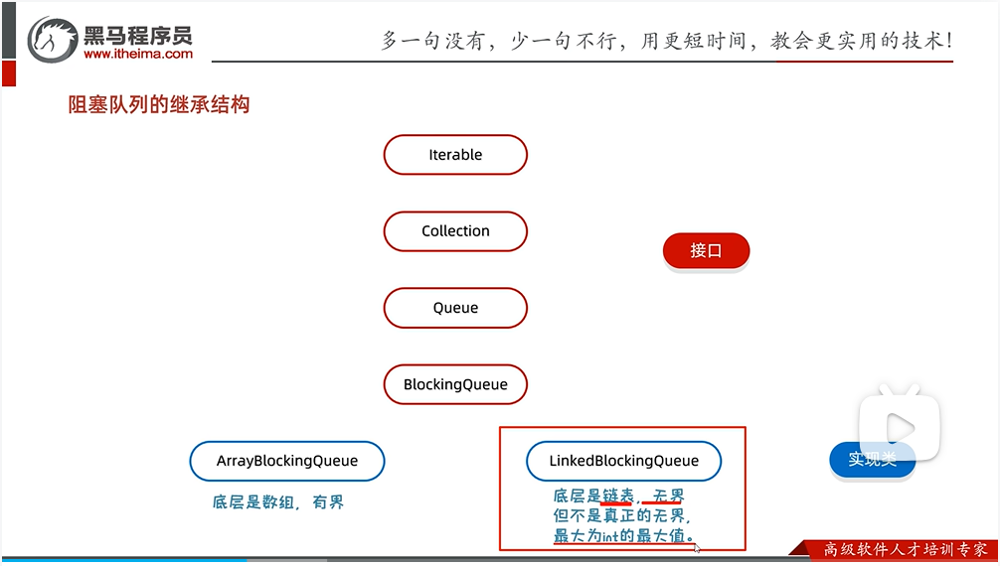

# 设计模式

## 先备知识

### pre1:线程与进程、并行与并发

当面临这些问题的时候，有两个关键词无法绕开，那就是**并行**和**并发**。

首先，要先了解几个概念：

　　1、进程是程序的一次执行。

　　2、进程是资源分配的基本单位（调度单位）。

　　3、一个进程可以包括多个线程。

　　4、在单CPU计算机中，有一个资源是无法被多个程序并行使用的：CPU。

　　5、操作系统调度器：拆分CPU为一段段时间的运行片，轮流分配给不同的程序。

　　6、操作系统内存管理模块：管理物理内存、虚拟内存相关的事务。

**线程是CPU调度和分配的基本单位**，一定要和 **进程是操作系统进行资源分配（包括cpu、内存、磁盘IO等）的最小单位** 区别清楚。有句话说CPU只能看到线程，可以这么理解，假设我是CPU，我闭着眼，操作系统调度器将一个进程分配给我之后，我拿到进程睁开眼，我看到的是什么？我看到的是进程中的很多线程，那么我现在能调度和分配的是什么？进程？不行，因为我看不到其他进程，何来调度分配，只能调度我看到的那些线程，如果我是4核的话，把线程ABCD分配到核心1234，其他的线程依然要等待分配。

### Pre2：Java内存模型JMM

在JMM中抽象出了线程与主内存之间的关系：共享变量存储在主内存中，每个线程都有一个私有的本地变量，本地内存保存了被该线程使用到的的主内存数据副本拷贝，线程对变量的操作现在本地内存进行后再进行同步。


指令重排：在无依赖的指令间可能发生指令的重新排序。某些情况下如果有可能会导致解雇哟不符合预期，此时需要用volatile保障顺序（即线程安全中的有序性）

### Java多线程

#### 1.创建多线程的方式

##### 1.创建类继承Thread类

具体过程：创建类继承thread类并重写run方法，在主线程中创建对象并调用thread的start方法。

##### 2.创建类实现Runnable接口

具体过程：创建类接入runnable接口并重写run方法，在主线程中创建该类对象，以该对象为参数创建新线程，然后调用start。其中的runnable相当于指定新线程的方法体，

##### 3.利用Callable接口和Future接口（可获多线程的结果）

具体过程：创建类实现Callable接口并重写call方法，在主线程中创建该类，以该类为参数创建**FutureTask**类，然后将新创建的**FutureTask**作为参数创建新的线程，调用线程的start即可运行。如果想要获得结果，则直接调用**FutureTask**的get方法即可。

代码示例：

新类中的代码：

```Java
public class MyCallable implrements Callable<Integer>{//这个尖括号填写要返回数据的泛型
    @override
    public Integer call() throws Expection{//注意这里返回值类型也是泛型
        //填写方法体内容
    }
    return xxx
}
```

主线程中代码

```Java
public static void main(){
    MyCallable mc = new MyCallable();
    FutureTask ft = new FutureTask(mc);
    Thread t = new Thread(ft);//注意这里是以FutureTask为参数
    t.start();//使线程获得运行权
    Integer Result=ft.get();//注意这里承接结果的数据类型也是泛型
}
```

##### 小结优缺点：


#### 2.多线程的常见成员方法


##### 下面选几个详细介绍

##### 1 static void sleep(long time)

让线程休眠time毫秒，在睡眠时间内无运行权，睡眠结束后重新获得

##### 2. final void setDaemon(boolean on)

设置为守护线程，在非守护线程运行完毕后结束运行，**但是由于结束运行需要一段通知时间，所以守护线程不会立马结束**，可能会执行几次后才结束。

##### 3. public static void yield()

当执行这个语句时该线程会**出让CPU执行权**，让自己与其他线程**重新抢夺**计算资源

##### 4. public static void join()

将调用这个方法的线程插入到当前线程之前执行。

示例代码：

线程类的代码与1.1中创建过程一致，这里不重复。

主线程代码：

```Java
Public static void main(){
    MyThread t = new MyThread();
    t.start();
    t.join();
    for(int i=0;i<100;i++){
        System.out.println("Hello");
    }
}
```

在上述代码中如果没有写join方法的话，由于主线程现在占据着CPU，故本应该先执行完打印Hello的语句再执行MyThread中的语句。但现在有join，则意味着主线程会先让出计算资源给MyThread去执行语句，再执行接下来主线程的语句。

#### 3.线程的生命周期（复习的时候先看这个比较好理解）


#### 4.线程安全问题

##### 定义

当多个线程访问某个方法时，不管你通过怎样的调用方式或者说这些线程如何交替的执行，我们在主程序中不需要去做任何的同步，这个类的结果行为都是我们设想的正确行为，那么我们就可以说这个类时线程安全的。
如果一段代码可以保证多个线程访问的时候正确操作共享数据，那么它是线程安全的

##### 三核心

###### 1.原子性（运用同步和加锁处理）：

这一点，跟数据库事务的原子性概念差不多，即一个操作（有可能包含有多个子操作）要么全部执行（生效），要么全部都不执行（都不生效）。

关于原子性，一个非常经典的例子就是银行转账问题：比如A和B同时向C转账10万元（假设C本身就有20万）。如果转账操作不具有原子性，A转账后将数据30万写回给C账户，让C账户为30万。在预想情况下B应该在A写回数据30万后在进行转账得到40万，但由于操作不具有原子性就会有可能在A还未写回数据的情况下就开始进行，那么B拿到的数据就是20万，加完为30万，导致最后不符合所要的预期结果。

通俗易懂一点就是一个线程对共享数据还没操作并更新完（及操作还未完全执行）就让另一个线程把旧数据拿走进行操作导致错误发生。主要发生在多线程运行时取数据的不一致，即本应取已更新的内存中的数据却提前取了旧数据。（即共享数据操作不妥当）

###### 2.可见性：

可见性是指，当多个线程并发访问共享变量时，一个线程对共享变量的修改，其它线程能够立即看到。

CPU从主内存中读数据的效率相对来说不高，现在主流的计算机中，都有几级缓存。每个线程读取共享变量时，都会将该变量加载进其对应CPU的高速缓存里，修改该变量后，CPU会立即更新该缓存，但并不一定会立即将其写回主内存（实际上写回主内存的时间不可预期）。此时其它线程（尤其是不在同一个CPU上执行的线程）访问该变量时，从主内存中读到的就是旧的数据，而非第一个线程更新后的数据。

简单来说就是一个线程中的共享数据更新但是没带动其他线程的数据更新（类比github，共享数据就是主轴资源，分支更新了带动着主轴数据更新，但是各分支在未拉取到主轴数据时是未更新的，这就是不可见，可见就要做到及时更新）

主要就是发生在更新的数据还未更新到内存中，导致别的线程取的是旧数据

###### 3.有序性：

在执行程序时，为了提高性能，编译器和处理器常常会对指令做重排序；
重排序不会影响单线程的执行结果，但是在并发情况下，可能会出现诡异的BUG。

举例BUG：


Java 中可以使用 volatile 来保证顺序性，synchronized 和 Lock 也可以来保证有序性，和保证原子性的方式一样，通过同一段时间只能一个线程访问来实现的。

除了通过 volatile 关键字显式的保证顺序之外， JVM 还通过 happen-before 原则来隐式的保证顺序性。其中有一条就是适用于 volatile 关键字的，针对于 volatile 关键字的写操作肯定是在读操作之前，也就是说读取的值肯定是最新的。

###### P.S. ：volatile关键字（一般修饰变量，使其直接到主内存。修饰代码时则保证其不被优化）

volatile 关键字是用来保证数据的可见性。

从上述可见性的描述中，我们可以知道 CPU 高速缓存之间本身是不可见的，那么线程在读取变量的时候就有可能会读到脏数据。而**使用 volatile 关键字对变量进行修饰的话，对于读来说，会直接从内存里面去取数据而不会利用缓存；对于写来说，可以先写入缓存中但会立刻刷到内存中。但是volatile并不能保证我们操作的一个原子性（还是要通过加锁来实现）**，所以它是不能取代 synchronized 的。此外 volatile 关键字会阻止编译器对我们的程序进行优化，所以一般不建议使用 volatile 关键字。

总结：volatile关键字就是在多线程的操作当中，保证变量的一个可见性，避免多线程操作下读到脏数据。

##### 锁

确保互斥和可见

原理：

首先了解monitor。Monitor 是一种同步机制，负责管理对象的锁。每个对象都与一个 Monitor 相关联。当线程要进入代码时，线程会检查锁对象的monitor，若发现已被占则不进入接下来的代码，否则进入。（就是像是monitor来检测里面有没有人，没有就进，否则反之）

###### 1. synchronized(跳出限定区域自动开锁)

原理：

首先了解monitor。Monitor 是一种同步机制，负责管理对象的锁。每个对象都与一个 Monitor 相关联。当线程要进入代码时，线程会检查锁对象的monitor，若发现已被占则不进入接下来的代码，否则进入。由于每个对象都有唯一的monitor，故锁对象可任意。

特点：该锁默认打开，当有线程进入时关锁，但线程执行完毕后开锁。

原文截图：


原文链接：http://t.csdnimg.cn/XQVsc

举例：

1. synchronized代码块：synchronized(锁对象){//锁的对象任意，但一定要唯一。}

```Java
public MyThread extends Thread(){
    static Object obj = new Object();
    public MyThread{}
    @override
    public void run(){
        synchronized(obj){//synchronized括号内的是锁的对象，该对象任意，但一定要唯一，例如Mythread.class。
           //方法体
        }
    }
}
```

2. synchronized方法

   

通过synchronized，多线程在要执行synchronized括起来的代码时就回保证线程安全

###### 2. lock（手动开关锁）

原理：通过新建立的锁的monitor来识别。

设立原因和注意事项：


举例：


注意点：

1.第10行中的lock创建方式

2.注意是哪里解的锁，下文将仔细描述。

问题代码：

```java
static Lock Lock=new ReentratantLock();
public void run(){
    while(true){//假设主程序中有两个线程
       Lock.lock();
        if(ticcket==100){
            break;
        }else{
            try{
                thread.sleep(10);
            }catch(InterruptedException e){
                e.printStackTrance();
            }
            ticket++;
            System.out.println(getName()+"在卖第"+ticket+"张票");
        }
        Lock,unlock();
    }
}
```

解析：在上面的代码中，当票数达到一百时就会跳出循环，但是锁没有解除，这就导致虽然有一方确实已经完成run任务，但是还有一个线程没有完成。而这个线程因为将CPU上了锁未解开导致无法进入CPU，就一直卡在锁外完成不了线程任务。最后导致程序无法结束。

修改代码：

```java
static Lock Lock=new ReentratantLock();
public void run(){
    while(true){//假设主程序中有两个线程
       Lock.lock();
        try{
            if(ticcket==100){
                break;
            }else{
                thread.sleep(10);
                ticket++;
                System.out.println(getName()+"在卖第"+ticket+"张票");
            }
        }catch(InterruptedException e){
                e.printStackTrance();
            }finally{
              Lock,unlock();
        }
    }
}
```

这样就好了。

###### 锁的错误情况——死锁（锁的嵌套）

主线程代码是用thread开两段线程,赋名线程A、B然后start，不赘述。

线程类代码：

```java
static Object objA=new object();
static Object objB=new object();
public void run(){
    while(true){
        if("线程A".equals(getName())){
			synchronized (objA){
                System.out.println("线程A拿到了A锁，准备拿B锁");
                synchronized (objB){
                    System.out.println("线程A拿到了b锁，一轮完毕");    
                }
            }
         }else if("线程B".equals(getName())){
			synchronized (objB){
                System.out.println("线程B拿到了B锁，准备拿A锁");
                synchronized (objA){
                    System.out.println("线程B拿到了A锁，一轮完毕");    
                }
       	 	}
        } 
    }
}
```

在上面的代码中，假设A拿到线权，执行到A拿完A锁时(A锁没还），B也同时拿到线权执行B拿完B锁（B锁没还），然后双方都在等待对方的锁又拿不到，导致两条线程都无法顺利结束导致程序无法停止。

#### 5.等待唤醒机制的实现

##### 1.生产者消费者模式

思路：


相关函数：


具体代码：

1.生产者

```java
public class cook(){
     while(true){
       synchronized(Desk.Lock){
           if(Desk.count==0){
               break;
           }else{
               if(Desk.foodFlag==1){
                	try{
                           Desk.Lock.wait();//将锁和线程绑定，便于后续唤醒
                    }catch(InterruptedException e){
                e.printStackTrance();
          			 }
               }else{
                   //相关核心代码
                   Desk.Lock.notifyAll();//开启这条锁上的所有线程
               }
           }
       }
    }
}
```

2.消费者

```java
public class foodie(){
    while(true){
       synchronized(Desk.Lock){
           if(Desk.count==0){
               break;
           }else{
               if(Desk.foodFlag==0){
                	try{
                           Desk.Lock.wait();//将锁和线程绑定，便于后续唤醒
                    }catch(InterruptedException e){
                e.printStackTrance();
          			 }
               }else{
                   //相关核心代码
                   Desk.Lock.notifyAll();//开启这条锁上的所有线程
               }
           }
       }
    }
}
```

3.媒介

```java
public class desk(){
    public static int foodFlag=0;//线程数，用于切换
    public static int count =10;//数据量
    public static Lock obj=new Object();//锁对象
}
```

4.主线程代码就是创建生产者和消费者对象然后start，不赘述

##### 2.阻塞队列方式




书写方式：

1.接收者


**注意阻塞队列是怎么创建的**

2.发送者：


**注意阻塞队列是怎么创建的**

3.主线程


**注意阻塞队列是怎么创建的**

**注意点**

1.put,take内自带锁，使用时不要嵌套锁导致死锁


#### 6.线程池

##### 1.普通线程池

线程池储存线程来进行多线程操作。

1.线程池的创建(Executors类方法)

```java
//1.获取上限为int上线的线程池
ExecutorService pool1=Executors.newCachedThreadPool();

//或者自定义上限的ExecutorService pool1=Executors.newFixedThreadPool(num);

//2.赋任务
pool1.sumbit(new Runnable());
pool1.sumbit(new Runnable());
pool1.sumbit(new Runnable());
//3.消除线程池
pool1.shutdown();
//此时获取的线程名字既有池名也有线程序号，这里的线程序号不是自己创建的那个线程序号，是pool中的，比如pool中同时执行2个线程就会有1、2之分。单独执行就都是1。
```

总结：


##### 2.自定义线程池

newCachedThreadPool()的七个参数：


任务进出线程池过程：

先由核心线程去完成工作。如果有剩余，如果剩余的任务小于等于阻塞队列数，则排队等待。否则先将阻塞队列填满，再创建临时线程去完成任务。如果这个情况下还不够，则触发拒绝策略。

拒绝策略有四种（**四种都是内部类，要做参数时要new出来**）：

1.ThreadPoolExecutor.AbortPolicy舍弃任务，抛出异常（默认）

2.ThreadPoolExecutor.DiscardPolicy:丢弃任务，不抛出异常

3.ThreadPoolExecutor.DiscardOldestPolicy:抛弃队列中等待最久的任务，然后将多的任务加入到队列中

4.ThreadPoolExecutor.CallerRunsPolicy:直接调用任务的run方法跳过线程池运行。

注意：

1.时间单位的指定要用TimeUnit类中挑选

2.创建线程方式参数要填的是Executors.defaultThreadFactor(),这个方法底层也是new Thread，不过经过了一些处理。
